# 用户消费行为分析

## 一、项目介绍

本案例分析了来自CDNow网站的一份用户购买CD明细，
业务结合技术进一步分析用户的消费行为，
提高决策质量。  
数据包括用户ID，购买日期，购买数量，
购买金额四个字段。

**目的**：根据CD网站的用户购买明细，分析用户消费行为

## 二、分析步骤

使用mermaid在线编辑器绘制分析流程图  
https://mermaid-js.github.io/mermaid-live-editor/   
（绘制完成后将文件保存到本地文件夹，再插入markdown文件）


## 三、具体内容

### 1. 准备工作

* **导入常用库及常规设置**


```python
import os
import pandas as pd
from matplotlib import pyplot as plt
import numpy as np


# 让图表显示中文
plt.rcParams['font.sans-serif'] = ['SimHei']  # 用来正常显示中文标签
plt.rcParams['axes.unicode_minus'] = False  # 用来正常显示负号
plt.style.use("ggplot")  # 设置图表样式
```

* **导入数据**


```python
file_path = r"数据\CDNOW_master.txt"
# 这里一定要写names=[]，不然会把第0行的数据当成colunms的
# 分隔符是空格用\s+表示匹配任意空白符 
df = pd.read_csv(file_path, 
                    sep="\s+", 
                    names=["用户id", "日期", "订单数", "金额"])
df
```


<div>
<style scoped>
    .dataframe tbody tr th:only-of-type {
        vertical-align: middle;
    }

    .dataframe tbody tr th {
        vertical-align: top;
    }

    .dataframe thead th {
        text-align: right;
    }
</style>
<table border="1" class="dataframe">
  <thead>
    <tr style="text-align: right;">
      <th></th>
      <th>用户id</th>
      <th>日期</th>
      <th>订单数</th>
      <th>金额</th>
    </tr>
  </thead>
  <tbody>
    <tr>
      <th>0</th>
      <td>1</td>
      <td>19970101</td>
      <td>1</td>
      <td>11.77</td>
    </tr>
    <tr>
      <th>1</th>
      <td>2</td>
      <td>19970112</td>
      <td>1</td>
      <td>12.00</td>
    </tr>
    <tr>
      <th>2</th>
      <td>2</td>
      <td>19970112</td>
      <td>5</td>
      <td>77.00</td>
    </tr>
    <tr>
      <th>3</th>
      <td>3</td>
      <td>19970102</td>
      <td>2</td>
      <td>20.76</td>
    </tr>
    <tr>
      <th>4</th>
      <td>3</td>
      <td>19970330</td>
      <td>2</td>
      <td>20.76</td>
    </tr>
    <tr>
      <th>...</th>
      <td>...</td>
      <td>...</td>
      <td>...</td>
      <td>...</td>
    </tr>
    <tr>
      <th>69654</th>
      <td>23568</td>
      <td>19970405</td>
      <td>4</td>
      <td>83.74</td>
    </tr>
    <tr>
      <th>69655</th>
      <td>23568</td>
      <td>19970422</td>
      <td>1</td>
      <td>14.99</td>
    </tr>
    <tr>
      <th>69656</th>
      <td>23569</td>
      <td>19970325</td>
      <td>2</td>
      <td>25.74</td>
    </tr>
    <tr>
      <th>69657</th>
      <td>23570</td>
      <td>19970325</td>
      <td>3</td>
      <td>51.12</td>
    </tr>
    <tr>
      <th>69658</th>
      <td>23570</td>
      <td>19970326</td>
      <td>2</td>
      <td>42.96</td>
    </tr>
  </tbody>
</table>
<p>69659 rows × 4 columns</p>
</div>


* **数据清洗**  
查看有没有缺失值


```python
df.isnull().sum()
```


    用户id    0
    日期      0
    订单数     0
    金额      0
    dtype: int64


输出结果表明并没有缺失值，不用进行缺失值处理操作

* **数据类型转换**  
处理日期格式


```python
df_date = pd.to_datetime(df["日期"], format="%Y%m%d")
df["日期"] = df_date
# 将日期按月份显示
df_month = df_date.values.astype("datetime64[M]")
df["月份"] = df_month
df
```


<div>
<style scoped>
    .dataframe tbody tr th:only-of-type {
        vertical-align: middle;
    }

    .dataframe tbody tr th {
        vertical-align: top;
    }

    .dataframe thead th {
        text-align: right;
    }
</style>
<table border="1" class="dataframe">
  <thead>
    <tr style="text-align: right;">
      <th></th>
      <th>用户id</th>
      <th>日期</th>
      <th>订单数</th>
      <th>金额</th>
      <th>月份</th>
    </tr>
  </thead>
  <tbody>
    <tr>
      <th>0</th>
      <td>1</td>
      <td>1997-01-01</td>
      <td>1</td>
      <td>11.77</td>
      <td>1997-01-01</td>
    </tr>
    <tr>
      <th>1</th>
      <td>2</td>
      <td>1997-01-12</td>
      <td>1</td>
      <td>12.00</td>
      <td>1997-01-01</td>
    </tr>
    <tr>
      <th>2</th>
      <td>2</td>
      <td>1997-01-12</td>
      <td>5</td>
      <td>77.00</td>
      <td>1997-01-01</td>
    </tr>
    <tr>
      <th>3</th>
      <td>3</td>
      <td>1997-01-02</td>
      <td>2</td>
      <td>20.76</td>
      <td>1997-01-01</td>
    </tr>
    <tr>
      <th>4</th>
      <td>3</td>
      <td>1997-03-30</td>
      <td>2</td>
      <td>20.76</td>
      <td>1997-03-01</td>
    </tr>
    <tr>
      <th>...</th>
      <td>...</td>
      <td>...</td>
      <td>...</td>
      <td>...</td>
      <td>...</td>
    </tr>
    <tr>
      <th>69654</th>
      <td>23568</td>
      <td>1997-04-05</td>
      <td>4</td>
      <td>83.74</td>
      <td>1997-04-01</td>
    </tr>
    <tr>
      <th>69655</th>
      <td>23568</td>
      <td>1997-04-22</td>
      <td>1</td>
      <td>14.99</td>
      <td>1997-04-01</td>
    </tr>
    <tr>
      <th>69656</th>
      <td>23569</td>
      <td>1997-03-25</td>
      <td>2</td>
      <td>25.74</td>
      <td>1997-03-01</td>
    </tr>
    <tr>
      <th>69657</th>
      <td>23570</td>
      <td>1997-03-25</td>
      <td>3</td>
      <td>51.12</td>
      <td>1997-03-01</td>
    </tr>
    <tr>
      <th>69658</th>
      <td>23570</td>
      <td>1997-03-26</td>
      <td>2</td>
      <td>42.96</td>
      <td>1997-03-01</td>
    </tr>
  </tbody>
</table>
<p>69659 rows × 5 columns</p>
</div>


### 2. 用户消费趋势分析

#### 包括以下内容：

* 每月消费总人数
* 每月产品购买量
* 每月消费总金额
* 平均每用户产生的订单数（每月）
* 平均每用户产生的订单金额（每月）

#### 实现步骤如下：

* **按月份聚合**（因为研究的内容是以月为单位的）


```python
df_new = df.pivot_table(index="月份",
                        values=["用户id", "订单数", "金额"],
                        aggfunc={"用户id": "count",
                                "订单数": "sum",
                                "金额": "sum"}, )
df_new
```


<div>
<style scoped>
    .dataframe tbody tr th:only-of-type {
        vertical-align: middle;
    }

    .dataframe tbody tr th {
        vertical-align: top;
    }

    .dataframe thead th {
        text-align: right;
    }
</style>
<table border="1" class="dataframe">
  <thead>
    <tr style="text-align: right;">
      <th></th>
      <th>用户id</th>
      <th>订单数</th>
      <th>金额</th>
    </tr>
    <tr>
      <th>月份</th>
      <th></th>
      <th></th>
      <th></th>
    </tr>
  </thead>
  <tbody>
    <tr>
      <th>1997-01-01</th>
      <td>8928</td>
      <td>19416</td>
      <td>299060.17</td>
    </tr>
    <tr>
      <th>1997-02-01</th>
      <td>11272</td>
      <td>24921</td>
      <td>379590.03</td>
    </tr>
    <tr>
      <th>1997-03-01</th>
      <td>11598</td>
      <td>26159</td>
      <td>393155.27</td>
    </tr>
    <tr>
      <th>1997-04-01</th>
      <td>3781</td>
      <td>9729</td>
      <td>142824.49</td>
    </tr>
    <tr>
      <th>1997-05-01</th>
      <td>2895</td>
      <td>7275</td>
      <td>107933.30</td>
    </tr>
    <tr>
      <th>1997-06-01</th>
      <td>3054</td>
      <td>7301</td>
      <td>108395.87</td>
    </tr>
    <tr>
      <th>1997-07-01</th>
      <td>2942</td>
      <td>8131</td>
      <td>122078.88</td>
    </tr>
    <tr>
      <th>1997-08-01</th>
      <td>2320</td>
      <td>5851</td>
      <td>88367.69</td>
    </tr>
    <tr>
      <th>1997-09-01</th>
      <td>2296</td>
      <td>5729</td>
      <td>81948.80</td>
    </tr>
    <tr>
      <th>1997-10-01</th>
      <td>2562</td>
      <td>6203</td>
      <td>89780.77</td>
    </tr>
    <tr>
      <th>1997-11-01</th>
      <td>2750</td>
      <td>7812</td>
      <td>115448.64</td>
    </tr>
    <tr>
      <th>1997-12-01</th>
      <td>2504</td>
      <td>6418</td>
      <td>95577.35</td>
    </tr>
    <tr>
      <th>1998-01-01</th>
      <td>2032</td>
      <td>5278</td>
      <td>76756.78</td>
    </tr>
    <tr>
      <th>1998-02-01</th>
      <td>2026</td>
      <td>5340</td>
      <td>77096.96</td>
    </tr>
    <tr>
      <th>1998-03-01</th>
      <td>2793</td>
      <td>7431</td>
      <td>108970.15</td>
    </tr>
    <tr>
      <th>1998-04-01</th>
      <td>1878</td>
      <td>4697</td>
      <td>66231.52</td>
    </tr>
    <tr>
      <th>1998-05-01</th>
      <td>1985</td>
      <td>4903</td>
      <td>70989.66</td>
    </tr>
    <tr>
      <th>1998-06-01</th>
      <td>2043</td>
      <td>5287</td>
      <td>76109.30</td>
    </tr>
  </tbody>
</table>
</div>


* **重命名列**（因为后面使用matplotlib生成图表时，label名会直接使用列名）


```python
df_new.rename(
        columns={
                "月份": "月份",
                "用户id": "每月消费人数",
                "订单数": "每月产品购买量",
                "金额": "每月消费总金额"}, 
        inplace=True)
df_new
```


<div>
<style scoped>
    .dataframe tbody tr th:only-of-type {
        vertical-align: middle;
    }

    .dataframe tbody tr th {
        vertical-align: top;
    }

    .dataframe thead th {
        text-align: right;
    }
</style>
<table border="1" class="dataframe">
  <thead>
    <tr style="text-align: right;">
      <th></th>
      <th>每月消费人数</th>
      <th>每月产品购买量</th>
      <th>每月消费总金额</th>
    </tr>
    <tr>
      <th>月份</th>
      <th></th>
      <th></th>
      <th></th>
    </tr>
  </thead>
  <tbody>
    <tr>
      <th>1997-01-01</th>
      <td>8928</td>
      <td>19416</td>
      <td>299060.17</td>
    </tr>
    <tr>
      <th>1997-02-01</th>
      <td>11272</td>
      <td>24921</td>
      <td>379590.03</td>
    </tr>
    <tr>
      <th>1997-03-01</th>
      <td>11598</td>
      <td>26159</td>
      <td>393155.27</td>
    </tr>
    <tr>
      <th>1997-04-01</th>
      <td>3781</td>
      <td>9729</td>
      <td>142824.49</td>
    </tr>
    <tr>
      <th>1997-05-01</th>
      <td>2895</td>
      <td>7275</td>
      <td>107933.30</td>
    </tr>
    <tr>
      <th>1997-06-01</th>
      <td>3054</td>
      <td>7301</td>
      <td>108395.87</td>
    </tr>
    <tr>
      <th>1997-07-01</th>
      <td>2942</td>
      <td>8131</td>
      <td>122078.88</td>
    </tr>
    <tr>
      <th>1997-08-01</th>
      <td>2320</td>
      <td>5851</td>
      <td>88367.69</td>
    </tr>
    <tr>
      <th>1997-09-01</th>
      <td>2296</td>
      <td>5729</td>
      <td>81948.80</td>
    </tr>
    <tr>
      <th>1997-10-01</th>
      <td>2562</td>
      <td>6203</td>
      <td>89780.77</td>
    </tr>
    <tr>
      <th>1997-11-01</th>
      <td>2750</td>
      <td>7812</td>
      <td>115448.64</td>
    </tr>
    <tr>
      <th>1997-12-01</th>
      <td>2504</td>
      <td>6418</td>
      <td>95577.35</td>
    </tr>
    <tr>
      <th>1998-01-01</th>
      <td>2032</td>
      <td>5278</td>
      <td>76756.78</td>
    </tr>
    <tr>
      <th>1998-02-01</th>
      <td>2026</td>
      <td>5340</td>
      <td>77096.96</td>
    </tr>
    <tr>
      <th>1998-03-01</th>
      <td>2793</td>
      <td>7431</td>
      <td>108970.15</td>
    </tr>
    <tr>
      <th>1998-04-01</th>
      <td>1878</td>
      <td>4697</td>
      <td>66231.52</td>
    </tr>
    <tr>
      <th>1998-05-01</th>
      <td>1985</td>
      <td>4903</td>
      <td>70989.66</td>
    </tr>
    <tr>
      <th>1998-06-01</th>
      <td>2043</td>
      <td>5287</td>
      <td>76109.30</td>
    </tr>
  </tbody>
</table>
</div>


* **增加两列**


```python
df_new["平均每用户产生的订单数"] = df_new["每月产品购买量"] / df_new["每月消费人数"]
df_new["平均每用户产生的订单金额"] = df_new["每月消费总金额"] / df_new["每月消费人数"]
df_new
```


<div>
<style scoped>
    .dataframe tbody tr th:only-of-type {
        vertical-align: middle;
    }

    .dataframe tbody tr th {
        vertical-align: top;
    }

    .dataframe thead th {
        text-align: right;
    }
</style>
<table border="1" class="dataframe">
  <thead>
    <tr style="text-align: right;">
      <th></th>
      <th>每月消费人数</th>
      <th>每月产品购买量</th>
      <th>每月消费总金额</th>
      <th>平均每用户产生的订单数</th>
      <th>平均每用户产生的订单金额</th>
    </tr>
    <tr>
      <th>月份</th>
      <th></th>
      <th></th>
      <th></th>
      <th></th>
      <th></th>
    </tr>
  </thead>
  <tbody>
    <tr>
      <th>1997-01-01</th>
      <td>8928</td>
      <td>19416</td>
      <td>299060.17</td>
      <td>2.174731</td>
      <td>33.496883</td>
    </tr>
    <tr>
      <th>1997-02-01</th>
      <td>11272</td>
      <td>24921</td>
      <td>379590.03</td>
      <td>2.210877</td>
      <td>33.675482</td>
    </tr>
    <tr>
      <th>1997-03-01</th>
      <td>11598</td>
      <td>26159</td>
      <td>393155.27</td>
      <td>2.255475</td>
      <td>33.898540</td>
    </tr>
    <tr>
      <th>1997-04-01</th>
      <td>3781</td>
      <td>9729</td>
      <td>142824.49</td>
      <td>2.573129</td>
      <td>37.774263</td>
    </tr>
    <tr>
      <th>1997-05-01</th>
      <td>2895</td>
      <td>7275</td>
      <td>107933.30</td>
      <td>2.512953</td>
      <td>37.282660</td>
    </tr>
    <tr>
      <th>1997-06-01</th>
      <td>3054</td>
      <td>7301</td>
      <td>108395.87</td>
      <td>2.390635</td>
      <td>35.493081</td>
    </tr>
    <tr>
      <th>1997-07-01</th>
      <td>2942</td>
      <td>8131</td>
      <td>122078.88</td>
      <td>2.763766</td>
      <td>41.495201</td>
    </tr>
    <tr>
      <th>1997-08-01</th>
      <td>2320</td>
      <td>5851</td>
      <td>88367.69</td>
      <td>2.521983</td>
      <td>38.089522</td>
    </tr>
    <tr>
      <th>1997-09-01</th>
      <td>2296</td>
      <td>5729</td>
      <td>81948.80</td>
      <td>2.495209</td>
      <td>35.691986</td>
    </tr>
    <tr>
      <th>1997-10-01</th>
      <td>2562</td>
      <td>6203</td>
      <td>89780.77</td>
      <td>2.421155</td>
      <td>35.043236</td>
    </tr>
    <tr>
      <th>1997-11-01</th>
      <td>2750</td>
      <td>7812</td>
      <td>115448.64</td>
      <td>2.840727</td>
      <td>41.981324</td>
    </tr>
    <tr>
      <th>1997-12-01</th>
      <td>2504</td>
      <td>6418</td>
      <td>95577.35</td>
      <td>2.563099</td>
      <td>38.169868</td>
    </tr>
    <tr>
      <th>1998-01-01</th>
      <td>2032</td>
      <td>5278</td>
      <td>76756.78</td>
      <td>2.597441</td>
      <td>37.774006</td>
    </tr>
    <tr>
      <th>1998-02-01</th>
      <td>2026</td>
      <td>5340</td>
      <td>77096.96</td>
      <td>2.635735</td>
      <td>38.053781</td>
    </tr>
    <tr>
      <th>1998-03-01</th>
      <td>2793</td>
      <td>7431</td>
      <td>108970.15</td>
      <td>2.660580</td>
      <td>39.015449</td>
    </tr>
    <tr>
      <th>1998-04-01</th>
      <td>1878</td>
      <td>4697</td>
      <td>66231.52</td>
      <td>2.501065</td>
      <td>35.267050</td>
    </tr>
    <tr>
      <th>1998-05-01</th>
      <td>1985</td>
      <td>4903</td>
      <td>70989.66</td>
      <td>2.470025</td>
      <td>35.763053</td>
    </tr>
    <tr>
      <th>1998-06-01</th>
      <td>2043</td>
      <td>5287</td>
      <td>76109.30</td>
      <td>2.587861</td>
      <td>37.253696</td>
    </tr>
  </tbody>
</table>
</div>


* **生成图表**


```python
for i in range(0, 5):
    df_new.iloc[:, i].plot()
    plt.legend()
    plt.show()

```


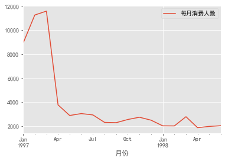


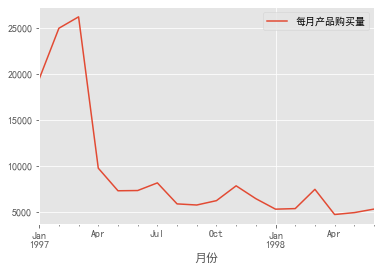


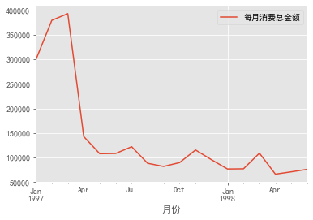


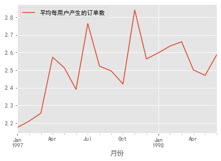


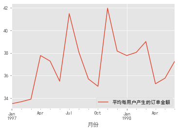


#### 结论：

* 由图1可知，1997年前3个月，每月消费总人数很多，
最多的月份为3月，数值接近12000人。而在4月份
出现陡然下降，当月消费总人数低至4000人以下。
往后的单月消费总人数维持在2000至3000左右。  

* 由图2可知，每月产品购买量几乎和每月消费总人数成正比关系。
1997年前3个月，每月产品购买量很多，
最多的月份为3月，数值超过26000件。而在4月份
出现陡然下降，当月产品购买量低至10000件。
往后的产品购买量维持在5000至8000左右。 

* 由图3可知，每月消费总金额几乎和每月消费总人数成正比关系。
1997年前3个月，消费总金额很多，
最多的月份为3月，金额接近40000元。而在4月份
出现陡然下降，当月消费总金额低至150000元以下。
往后的消费总金额维持在5000至12000左右。 

* 由图4可知，平均每用户产生的订单数，与时间变化的关系
不大，维持在2.1至2.9之间。

* 由图5可知，评论每用户产生的订单金额与平均每用户产生的订单数
基本成正比的关系，与实践变化的关系不大，维持在32至42之间。

### 3. 用户个体消费分析

#### 包括以下内容：

* 用户首次购买的时间与人数的曲线图
* 用户最后一次购买的时间与人数的曲线图
* 只消费一次的用户占比
    * 总占比
    * 每月新增只消费一次用户数
* 用户分层
    * RFC模型
    * 新用户、活跃用户、流失用户、回流用户占比
* 用户购买周期
* 用户生命周期

#### 实现步骤如下：

* **用户首次购买的时间与人数的曲线图**


```python
#按用户聚合
df_groupby = df.groupby("用户id")
df_groupby
```


    <pandas.core.groupby.generic.DataFrameGroupBy object at 0x00000207253B2988>


```python
# 每个用户第一次购买的日期
first_time = df_groupby.min()["日期"]  # min()表示最小，时间里越小，就越早
first_time
```


    用户id
    1       1997-01-01
    2       1997-01-12
    3       1997-01-02
    4       1997-01-01
    5       1997-01-01
               ...    
    23566   1997-03-25
    23567   1997-03-25
    23568   1997-03-25
    23569   1997-03-25
    23570   1997-03-25
    Name: 日期, Length: 23570, dtype: datetime64[ns]


```python
# 统计相同日期里有多少个用户第一次购买
first_time_count = first_time.value_counts()
first_time_count
```


    1997-02-08    363
    1997-02-24    347
    1997-02-04    346
    1997-02-06    346
    1997-03-04    340
                 ... 
    1997-01-08    213
    1997-03-21    213
    1997-01-07    211
    1997-01-01    209
    1997-01-04    174
    Name: 日期, Length: 84, dtype: int64


```python
first_time_count.plot()
plt.title("用户首次购买时间与人数的曲线图")
plt.xlabel("日期")
plt.ylabel("首次购买人数")
plt.show()
```


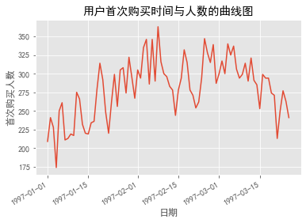


结论：  
由上图可知，用户首次消费时间发生在1997年的前三个月，
而后不再发生首次购买行为（即不再有新用户出现）。首次
购买的用户数随时间的变化，呈波动上升然后波动下降趋势，
其中首次购买人数最多的一天发生在2月份，人数超过了350人。

* **用户最后一次购买的时间与人数的曲线图**


```python
#每个用户最后一次购买的日期
last_time = df_groupby.max()["日期"]

#统计相同日期里有多少个用户最后一次购买
first_time_count = last_time.value_counts()
first_time_count
```


    1997-02-08    221
    1997-03-12    213
    1997-02-04    210
    1997-03-06    204
    1997-02-27    202
                 ... 
    1997-07-04      4
    1997-10-19      4
    1997-07-18      4
    1997-06-18      4
    1997-07-13      4
    Name: 日期, Length: 546, dtype: int64


```python
#画出曲线
first_time_count.plot()
plt.title("用户最后一次购买时间与人数的曲线图")
plt.xlabel("日期")
plt.ylabel("最后一次购买人数")
plt.show()
```


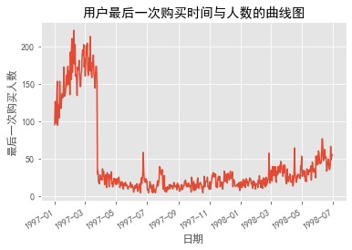


结论：  
上图显示，用户最后一次消费行为在1997年前三个月最多，
人数在100-200之间，之后最后一次消费的人数陡然下降，并
保持在0-20人之间。结合用户首次消费人数与时间关系图，可知
在1997年的前三个月，已有大约2/3的用户流失，而后没有新用户
增加，却每天有0-20用户流失。


* **只消费一次的用户占比**
    * 总占比


```python
# 找出每个用户第一次消费的时间和最后一次消费的时间
first_last = df_groupby["日期"].agg(["min", "max"])  # agg是聚合函数
first_last
```


<div>
<style scoped>
    .dataframe tbody tr th:only-of-type {
        vertical-align: middle;
    }

    .dataframe tbody tr th {
        vertical-align: top;
    }

    .dataframe thead th {
        text-align: right;
    }
</style>
<table border="1" class="dataframe">
  <thead>
    <tr style="text-align: right;">
      <th></th>
      <th>min</th>
      <th>max</th>
    </tr>
    <tr>
      <th>用户id</th>
      <th></th>
      <th></th>
    </tr>
  </thead>
  <tbody>
    <tr>
      <th>1</th>
      <td>1997-01-01</td>
      <td>1997-01-01</td>
    </tr>
    <tr>
      <th>2</th>
      <td>1997-01-12</td>
      <td>1997-01-12</td>
    </tr>
    <tr>
      <th>3</th>
      <td>1997-01-02</td>
      <td>1998-05-28</td>
    </tr>
    <tr>
      <th>4</th>
      <td>1997-01-01</td>
      <td>1997-12-12</td>
    </tr>
    <tr>
      <th>5</th>
      <td>1997-01-01</td>
      <td>1998-01-03</td>
    </tr>
    <tr>
      <th>...</th>
      <td>...</td>
      <td>...</td>
    </tr>
    <tr>
      <th>23566</th>
      <td>1997-03-25</td>
      <td>1997-03-25</td>
    </tr>
    <tr>
      <th>23567</th>
      <td>1997-03-25</td>
      <td>1997-03-25</td>
    </tr>
    <tr>
      <th>23568</th>
      <td>1997-03-25</td>
      <td>1997-04-22</td>
    </tr>
    <tr>
      <th>23569</th>
      <td>1997-03-25</td>
      <td>1997-03-25</td>
    </tr>
    <tr>
      <th>23570</th>
      <td>1997-03-25</td>
      <td>1997-03-26</td>
    </tr>
  </tbody>
</table>
<p>23570 rows × 2 columns</p>
</div>


```python
# 统计第一次消费时间==最后一次消费时间 的个数
counts = (first_last["min"] == first_last["max"]).value_counts()
counts
```


    True     12054
    False    11516
    dtype: int64


```python
#重命名index
counts=pd.Series({
    "只购买一次的用户":counts[0],
    "购买多次的用户":counts[1]
})
counts
```


    只购买一次的用户    11516
    购买多次的用户     12054
    dtype: int64


```python
counts.plot(kind="pie",
            autopct="%.2f%%", 
            title="只购买一次的用户占比")
plt.show()
```


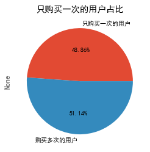


结论：  
由上图可知，只购买一次的用户占比为48.86%，接近一半，
说明目前的销售手段并不能有效地挽留客户。

* **只消费一次的用户占比**
    * 每月新增只消费一次用户数


```python
# 找出第一次消费的时间==最后一次消费时间的用户
first_last_ture = first_last[(first_last["min"] == first_last["max"])]
first_last_ture
```


<div>
<style scoped>
    .dataframe tbody tr th:only-of-type {
        vertical-align: middle;
    }

    .dataframe tbody tr th {
        vertical-align: top;
    }

    .dataframe thead th {
        text-align: right;
    }
</style>
<table border="1" class="dataframe">
  <thead>
    <tr style="text-align: right;">
      <th></th>
      <th>min</th>
      <th>max</th>
    </tr>
    <tr>
      <th>用户id</th>
      <th></th>
      <th></th>
    </tr>
  </thead>
  <tbody>
    <tr>
      <th>1</th>
      <td>1997-01-01</td>
      <td>1997-01-01</td>
    </tr>
    <tr>
      <th>2</th>
      <td>1997-01-12</td>
      <td>1997-01-12</td>
    </tr>
    <tr>
      <th>6</th>
      <td>1997-01-01</td>
      <td>1997-01-01</td>
    </tr>
    <tr>
      <th>10</th>
      <td>1997-01-21</td>
      <td>1997-01-21</td>
    </tr>
    <tr>
      <th>12</th>
      <td>1997-01-01</td>
      <td>1997-01-01</td>
    </tr>
    <tr>
      <th>...</th>
      <td>...</td>
      <td>...</td>
    </tr>
    <tr>
      <th>23562</th>
      <td>1997-03-25</td>
      <td>1997-03-25</td>
    </tr>
    <tr>
      <th>23565</th>
      <td>1997-03-25</td>
      <td>1997-03-25</td>
    </tr>
    <tr>
      <th>23566</th>
      <td>1997-03-25</td>
      <td>1997-03-25</td>
    </tr>
    <tr>
      <th>23567</th>
      <td>1997-03-25</td>
      <td>1997-03-25</td>
    </tr>
    <tr>
      <th>23569</th>
      <td>1997-03-25</td>
      <td>1997-03-25</td>
    </tr>
  </tbody>
</table>
<p>12054 rows × 2 columns</p>
</div>


```python
# 将日期转换为月份
first_last_ture_month = first_last_ture.values.astype("datetime64[M]")
first_last_ture_month
```


    array([['1997-01', '1997-01'],
           ['1997-01', '1997-01'],
           ['1997-01', '1997-01'],
           ...,
           ['1997-03', '1997-03'],
           ['1997-03', '1997-03'],
           ['1997-03', '1997-03']], dtype='datetime64[M]')


```python
# 放回原数组
first_last_ture.iloc[:,0] = first_last_ture_month[:, 0]
first_last_ture.iloc[:,1] = first_last_ture_month[:, 1]
first_last_ture
```

    D:\lx\anaconda\lib\site-packages\pandas\core\indexing.py:1048: SettingWithCopyWarning: 
    A value is trying to be set on a copy of a slice from a DataFrame.
    Try using .loc[row_indexer,col_indexer] = value instead
    
    See the caveats in the documentation: https://pandas.pydata.org/pandas-docs/stable/user_guide/indexing.html#returning-a-view-versus-a-copy
      self.obj[item_labels[indexer[info_axis]]] = value
    


<div>
<style scoped>
    .dataframe tbody tr th:only-of-type {
        vertical-align: middle;
    }

    .dataframe tbody tr th {
        vertical-align: top;
    }

    .dataframe thead th {
        text-align: right;
    }
</style>
<table border="1" class="dataframe">
  <thead>
    <tr style="text-align: right;">
      <th></th>
      <th>min</th>
      <th>max</th>
    </tr>
    <tr>
      <th>用户id</th>
      <th></th>
      <th></th>
    </tr>
  </thead>
  <tbody>
    <tr>
      <th>1</th>
      <td>1997-01-01</td>
      <td>1997-01-01</td>
    </tr>
    <tr>
      <th>2</th>
      <td>1997-01-01</td>
      <td>1997-01-01</td>
    </tr>
    <tr>
      <th>6</th>
      <td>1997-01-01</td>
      <td>1997-01-01</td>
    </tr>
    <tr>
      <th>10</th>
      <td>1997-01-01</td>
      <td>1997-01-01</td>
    </tr>
    <tr>
      <th>12</th>
      <td>1997-01-01</td>
      <td>1997-01-01</td>
    </tr>
    <tr>
      <th>...</th>
      <td>...</td>
      <td>...</td>
    </tr>
    <tr>
      <th>23562</th>
      <td>1997-03-01</td>
      <td>1997-03-01</td>
    </tr>
    <tr>
      <th>23565</th>
      <td>1997-03-01</td>
      <td>1997-03-01</td>
    </tr>
    <tr>
      <th>23566</th>
      <td>1997-03-01</td>
      <td>1997-03-01</td>
    </tr>
    <tr>
      <th>23567</th>
      <td>1997-03-01</td>
      <td>1997-03-01</td>
    </tr>
    <tr>
      <th>23569</th>
      <td>1997-03-01</td>
      <td>1997-03-01</td>
    </tr>
  </tbody>
</table>
<p>12054 rows × 2 columns</p>
</div>


```python
# 给数组增加一列，为用户个数，
# 因为现在的index是用户id，等下再按月聚合，就没有values了
# 所以增加一列，用户数，做values
first_last_ture.loc[:,"用户数"] = 1
first_last_ture
```

    D:\lx\anaconda\lib\site-packages\pandas\core\indexing.py:845: SettingWithCopyWarning: 
    A value is trying to be set on a copy of a slice from a DataFrame.
    Try using .loc[row_indexer,col_indexer] = value instead
    
    See the caveats in the documentation: https://pandas.pydata.org/pandas-docs/stable/user_guide/indexing.html#returning-a-view-versus-a-copy
      self.obj[key] = _infer_fill_value(value)
    D:\lx\anaconda\lib\site-packages\pandas\core\indexing.py:966: SettingWithCopyWarning: 
    A value is trying to be set on a copy of a slice from a DataFrame.
    Try using .loc[row_indexer,col_indexer] = value instead
    
    See the caveats in the documentation: https://pandas.pydata.org/pandas-docs/stable/user_guide/indexing.html#returning-a-view-versus-a-copy
      self.obj[item] = s
    


<div>
<style scoped>
    .dataframe tbody tr th:only-of-type {
        vertical-align: middle;
    }

    .dataframe tbody tr th {
        vertical-align: top;
    }

    .dataframe thead th {
        text-align: right;
    }
</style>
<table border="1" class="dataframe">
  <thead>
    <tr style="text-align: right;">
      <th></th>
      <th>min</th>
      <th>max</th>
      <th>用户数</th>
    </tr>
    <tr>
      <th>用户id</th>
      <th></th>
      <th></th>
      <th></th>
    </tr>
  </thead>
  <tbody>
    <tr>
      <th>1</th>
      <td>1997-01-01</td>
      <td>1997-01-01</td>
      <td>1</td>
    </tr>
    <tr>
      <th>2</th>
      <td>1997-01-01</td>
      <td>1997-01-01</td>
      <td>1</td>
    </tr>
    <tr>
      <th>6</th>
      <td>1997-01-01</td>
      <td>1997-01-01</td>
      <td>1</td>
    </tr>
    <tr>
      <th>10</th>
      <td>1997-01-01</td>
      <td>1997-01-01</td>
      <td>1</td>
    </tr>
    <tr>
      <th>12</th>
      <td>1997-01-01</td>
      <td>1997-01-01</td>
      <td>1</td>
    </tr>
    <tr>
      <th>...</th>
      <td>...</td>
      <td>...</td>
      <td>...</td>
    </tr>
    <tr>
      <th>23562</th>
      <td>1997-03-01</td>
      <td>1997-03-01</td>
      <td>1</td>
    </tr>
    <tr>
      <th>23565</th>
      <td>1997-03-01</td>
      <td>1997-03-01</td>
      <td>1</td>
    </tr>
    <tr>
      <th>23566</th>
      <td>1997-03-01</td>
      <td>1997-03-01</td>
      <td>1</td>
    </tr>
    <tr>
      <th>23567</th>
      <td>1997-03-01</td>
      <td>1997-03-01</td>
      <td>1</td>
    </tr>
    <tr>
      <th>23569</th>
      <td>1997-03-01</td>
      <td>1997-03-01</td>
      <td>1</td>
    </tr>
  </tbody>
</table>
<p>12054 rows × 3 columns</p>
</div>


```python
# 将仅消费一次的新用户按月份聚合
first_last_month = first_last_ture.groupby(["min", "max"])
# 统计每月用户数
first_last_month = first_last_month.count()
first_last_month
```


<div>
<style scoped>
    .dataframe tbody tr th:only-of-type {
        vertical-align: middle;
    }

    .dataframe tbody tr th {
        vertical-align: top;
    }

    .dataframe thead th {
        text-align: right;
    }
</style>
<table border="1" class="dataframe">
  <thead>
    <tr style="text-align: right;">
      <th></th>
      <th></th>
      <th>用户数</th>
    </tr>
    <tr>
      <th>min</th>
      <th>max</th>
      <th></th>
    </tr>
  </thead>
  <tbody>
    <tr>
      <th>1997-01-01</th>
      <th>1997-01-01</th>
      <td>3976</td>
    </tr>
    <tr>
      <th>1997-02-01</th>
      <th>1997-02-01</th>
      <td>4395</td>
    </tr>
    <tr>
      <th>1997-03-01</th>
      <th>1997-03-01</th>
      <td>3683</td>
    </tr>
  </tbody>
</table>
</div>


```python
first_last_month.plot()
plt.xticks([1, 2, 3])
plt.xlabel("月份")
plt.ylabel("新增只消费一次的用户数")
plt.show()
```


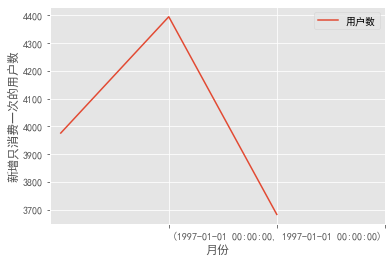


结论：由上图可知，只消费一次的用户只出现在1997年前三个月，
且呈上升再回落的趋势，其中2月达到最大，接近4400人，
3月下降到3700人以下

* **用户分层**
    * RFC模型  
        Recency:最后一次消费距离现在时间距离,R越小越好  
        Frequency:消费频率,F越大越好  
        Monetary:消费金额,M越大越好


```python
# 数据透视要用聚合之前的数据，因为它本身也是一种聚合
rfm = df.pivot_table(index="用户id",
                     values=["日期", "订单数", "金额"],
                     aggfunc={
                         "日期": "max",  # 最后一次消费的时间
                         "订单数": "sum",
                         "金额": "sum"
                     })
rfm
```


<div>
<style scoped>
    .dataframe tbody tr th:only-of-type {
        vertical-align: middle;
    }

    .dataframe tbody tr th {
        vertical-align: top;
    }

    .dataframe thead th {
        text-align: right;
    }
</style>
<table border="1" class="dataframe">
  <thead>
    <tr style="text-align: right;">
      <th></th>
      <th>日期</th>
      <th>订单数</th>
      <th>金额</th>
    </tr>
    <tr>
      <th>用户id</th>
      <th></th>
      <th></th>
      <th></th>
    </tr>
  </thead>
  <tbody>
    <tr>
      <th>1</th>
      <td>1997-01-01</td>
      <td>1</td>
      <td>11.77</td>
    </tr>
    <tr>
      <th>2</th>
      <td>1997-01-12</td>
      <td>6</td>
      <td>89.00</td>
    </tr>
    <tr>
      <th>3</th>
      <td>1998-05-28</td>
      <td>16</td>
      <td>156.46</td>
    </tr>
    <tr>
      <th>4</th>
      <td>1997-12-12</td>
      <td>7</td>
      <td>100.50</td>
    </tr>
    <tr>
      <th>5</th>
      <td>1998-01-03</td>
      <td>29</td>
      <td>385.61</td>
    </tr>
    <tr>
      <th>...</th>
      <td>...</td>
      <td>...</td>
      <td>...</td>
    </tr>
    <tr>
      <th>23566</th>
      <td>1997-03-25</td>
      <td>2</td>
      <td>36.00</td>
    </tr>
    <tr>
      <th>23567</th>
      <td>1997-03-25</td>
      <td>1</td>
      <td>20.97</td>
    </tr>
    <tr>
      <th>23568</th>
      <td>1997-04-22</td>
      <td>6</td>
      <td>121.70</td>
    </tr>
    <tr>
      <th>23569</th>
      <td>1997-03-25</td>
      <td>2</td>
      <td>25.74</td>
    </tr>
    <tr>
      <th>23570</th>
      <td>1997-03-26</td>
      <td>5</td>
      <td>94.08</td>
    </tr>
  </tbody>
</table>
<p>23570 rows × 3 columns</p>
</div>


```python
# 求R
# -（最后一次消费日期-统计的最后期限）输出结果带有day单位
# 除以np.timedelta64(1,"D")可将day去掉
rfm["R"] = -(rfm["日期"] - rfm["日期"].max()) / np.timedelta64(1, "D")
rfm["R"] 
```


    用户id
    1        545.0
    2        534.0
    3         33.0
    4        200.0
    5        178.0
             ...  
    23566    462.0
    23567    462.0
    23568    434.0
    23569    462.0
    23570    461.0
    Name: R, Length: 23570, dtype: float64


```python
# F其实就是订单数，M就是金额
rfm.rename(columns={"订单数": "F", "金额": "M"}, inplace=True)
rfm
```


<div>
<style scoped>
    .dataframe tbody tr th:only-of-type {
        vertical-align: middle;
    }

    .dataframe tbody tr th {
        vertical-align: top;
    }

    .dataframe thead th {
        text-align: right;
    }
</style>
<table border="1" class="dataframe">
  <thead>
    <tr style="text-align: right;">
      <th></th>
      <th>日期</th>
      <th>F</th>
      <th>M</th>
      <th>R</th>
    </tr>
    <tr>
      <th>用户id</th>
      <th></th>
      <th></th>
      <th></th>
      <th></th>
    </tr>
  </thead>
  <tbody>
    <tr>
      <th>1</th>
      <td>1997-01-01</td>
      <td>1</td>
      <td>11.77</td>
      <td>545.0</td>
    </tr>
    <tr>
      <th>2</th>
      <td>1997-01-12</td>
      <td>6</td>
      <td>89.00</td>
      <td>534.0</td>
    </tr>
    <tr>
      <th>3</th>
      <td>1998-05-28</td>
      <td>16</td>
      <td>156.46</td>
      <td>33.0</td>
    </tr>
    <tr>
      <th>4</th>
      <td>1997-12-12</td>
      <td>7</td>
      <td>100.50</td>
      <td>200.0</td>
    </tr>
    <tr>
      <th>5</th>
      <td>1998-01-03</td>
      <td>29</td>
      <td>385.61</td>
      <td>178.0</td>
    </tr>
    <tr>
      <th>...</th>
      <td>...</td>
      <td>...</td>
      <td>...</td>
      <td>...</td>
    </tr>
    <tr>
      <th>23566</th>
      <td>1997-03-25</td>
      <td>2</td>
      <td>36.00</td>
      <td>462.0</td>
    </tr>
    <tr>
      <th>23567</th>
      <td>1997-03-25</td>
      <td>1</td>
      <td>20.97</td>
      <td>462.0</td>
    </tr>
    <tr>
      <th>23568</th>
      <td>1997-04-22</td>
      <td>6</td>
      <td>121.70</td>
      <td>434.0</td>
    </tr>
    <tr>
      <th>23569</th>
      <td>1997-03-25</td>
      <td>2</td>
      <td>25.74</td>
      <td>462.0</td>
    </tr>
    <tr>
      <th>23570</th>
      <td>1997-03-26</td>
      <td>5</td>
      <td>94.08</td>
      <td>461.0</td>
    </tr>
  </tbody>
</table>
<p>23570 rows × 4 columns</p>
</div>


```python
# 分层
rfm_ = rfm[["R", "F", "M"]].apply(lambda x: x - x.mean())
rfm_
```


<div>
<style scoped>
    .dataframe tbody tr th:only-of-type {
        vertical-align: middle;
    }

    .dataframe tbody tr th {
        vertical-align: top;
    }

    .dataframe thead th {
        text-align: right;
    }
</style>
<table border="1" class="dataframe">
  <thead>
    <tr style="text-align: right;">
      <th></th>
      <th>R</th>
      <th>F</th>
      <th>M</th>
    </tr>
    <tr>
      <th>用户id</th>
      <th></th>
      <th></th>
      <th></th>
    </tr>
  </thead>
  <tbody>
    <tr>
      <th>1</th>
      <td>177.778362</td>
      <td>-6.122656</td>
      <td>-94.310426</td>
    </tr>
    <tr>
      <th>2</th>
      <td>166.778362</td>
      <td>-1.122656</td>
      <td>-17.080426</td>
    </tr>
    <tr>
      <th>3</th>
      <td>-334.221638</td>
      <td>8.877344</td>
      <td>50.379574</td>
    </tr>
    <tr>
      <th>4</th>
      <td>-167.221638</td>
      <td>-0.122656</td>
      <td>-5.580426</td>
    </tr>
    <tr>
      <th>5</th>
      <td>-189.221638</td>
      <td>21.877344</td>
      <td>279.529574</td>
    </tr>
    <tr>
      <th>...</th>
      <td>...</td>
      <td>...</td>
      <td>...</td>
    </tr>
    <tr>
      <th>23566</th>
      <td>94.778362</td>
      <td>-5.122656</td>
      <td>-70.080426</td>
    </tr>
    <tr>
      <th>23567</th>
      <td>94.778362</td>
      <td>-6.122656</td>
      <td>-85.110426</td>
    </tr>
    <tr>
      <th>23568</th>
      <td>66.778362</td>
      <td>-1.122656</td>
      <td>15.619574</td>
    </tr>
    <tr>
      <th>23569</th>
      <td>94.778362</td>
      <td>-5.122656</td>
      <td>-80.340426</td>
    </tr>
    <tr>
      <th>23570</th>
      <td>93.778362</td>
      <td>-2.122656</td>
      <td>-12.000426</td>
    </tr>
  </tbody>
</table>
<p>23570 rows × 3 columns</p>
</div>


```python
# 添加标签
# 每一行每一列的值，如果大于0（即大于平均数）标记1，否则标记0
for i in range(0, len(rfm_.iloc[0, :])):
    for j in range(0, len(rfm_.iloc[:, 0])):
        if rfm_.iloc[j, i] >= 0:
            rfm_.iloc[j, i] = str(1)
        else:
            rfm_.iloc[j, i] = str(0)
rfm_
```


<div>
<style scoped>
    .dataframe tbody tr th:only-of-type {
        vertical-align: middle;
    }

    .dataframe tbody tr th {
        vertical-align: top;
    }

    .dataframe thead th {
        text-align: right;
    }
</style>
<table border="1" class="dataframe">
  <thead>
    <tr style="text-align: right;">
      <th></th>
      <th>R</th>
      <th>F</th>
      <th>M</th>
    </tr>
    <tr>
      <th>用户id</th>
      <th></th>
      <th></th>
      <th></th>
    </tr>
  </thead>
  <tbody>
    <tr>
      <th>1</th>
      <td>1</td>
      <td>0</td>
      <td>0</td>
    </tr>
    <tr>
      <th>2</th>
      <td>1</td>
      <td>0</td>
      <td>0</td>
    </tr>
    <tr>
      <th>3</th>
      <td>0</td>
      <td>1</td>
      <td>1</td>
    </tr>
    <tr>
      <th>4</th>
      <td>0</td>
      <td>0</td>
      <td>0</td>
    </tr>
    <tr>
      <th>5</th>
      <td>0</td>
      <td>1</td>
      <td>1</td>
    </tr>
    <tr>
      <th>...</th>
      <td>...</td>
      <td>...</td>
      <td>...</td>
    </tr>
    <tr>
      <th>23566</th>
      <td>1</td>
      <td>0</td>
      <td>0</td>
    </tr>
    <tr>
      <th>23567</th>
      <td>1</td>
      <td>0</td>
      <td>0</td>
    </tr>
    <tr>
      <th>23568</th>
      <td>1</td>
      <td>0</td>
      <td>1</td>
    </tr>
    <tr>
      <th>23569</th>
      <td>1</td>
      <td>0</td>
      <td>0</td>
    </tr>
    <tr>
      <th>23570</th>
      <td>1</td>
      <td>0</td>
      <td>0</td>
    </tr>
  </tbody>
</table>
<p>23570 rows × 3 columns</p>
</div>


```python
# 添加标签
label_list = []
for i in range(1, rfm_.index.max() + 1):
    label_list.append(str(rfm_.loc[:, "R"][i]) + str(rfm_.loc[:, "F"][i]) + str(rfm_.loc[:, "M"][i]))

labels = {
    "111": "重要价值客户",
    "011": "重要保持客户",
    "001": "重要发展客户",
    "000": "一般发展客户",
    "101": "重要挽留客户",
    "100": "一般挽留客户",
    "110": "一般价值客户",
    "010": "一般保持客户"
}
rfm["标签"] = [labels[label_list[i]] for i in range(0, len(label_list))]
rfm
```


<div>
<style scoped>
    .dataframe tbody tr th:only-of-type {
        vertical-align: middle;
    }

    .dataframe tbody tr th {
        vertical-align: top;
    }

    .dataframe thead th {
        text-align: right;
    }
</style>
<table border="1" class="dataframe">
  <thead>
    <tr style="text-align: right;">
      <th></th>
      <th>日期</th>
      <th>F</th>
      <th>M</th>
      <th>R</th>
      <th>标签</th>
    </tr>
    <tr>
      <th>用户id</th>
      <th></th>
      <th></th>
      <th></th>
      <th></th>
      <th></th>
    </tr>
  </thead>
  <tbody>
    <tr>
      <th>1</th>
      <td>1997-01-01</td>
      <td>1</td>
      <td>11.77</td>
      <td>545.0</td>
      <td>一般挽留客户</td>
    </tr>
    <tr>
      <th>2</th>
      <td>1997-01-12</td>
      <td>6</td>
      <td>89.00</td>
      <td>534.0</td>
      <td>一般挽留客户</td>
    </tr>
    <tr>
      <th>3</th>
      <td>1998-05-28</td>
      <td>16</td>
      <td>156.46</td>
      <td>33.0</td>
      <td>重要保持客户</td>
    </tr>
    <tr>
      <th>4</th>
      <td>1997-12-12</td>
      <td>7</td>
      <td>100.50</td>
      <td>200.0</td>
      <td>一般发展客户</td>
    </tr>
    <tr>
      <th>5</th>
      <td>1998-01-03</td>
      <td>29</td>
      <td>385.61</td>
      <td>178.0</td>
      <td>重要保持客户</td>
    </tr>
    <tr>
      <th>...</th>
      <td>...</td>
      <td>...</td>
      <td>...</td>
      <td>...</td>
      <td>...</td>
    </tr>
    <tr>
      <th>23566</th>
      <td>1997-03-25</td>
      <td>2</td>
      <td>36.00</td>
      <td>462.0</td>
      <td>一般挽留客户</td>
    </tr>
    <tr>
      <th>23567</th>
      <td>1997-03-25</td>
      <td>1</td>
      <td>20.97</td>
      <td>462.0</td>
      <td>一般挽留客户</td>
    </tr>
    <tr>
      <th>23568</th>
      <td>1997-04-22</td>
      <td>6</td>
      <td>121.70</td>
      <td>434.0</td>
      <td>重要挽留客户</td>
    </tr>
    <tr>
      <th>23569</th>
      <td>1997-03-25</td>
      <td>2</td>
      <td>25.74</td>
      <td>462.0</td>
      <td>一般挽留客户</td>
    </tr>
    <tr>
      <th>23570</th>
      <td>1997-03-26</td>
      <td>5</td>
      <td>94.08</td>
      <td>461.0</td>
      <td>一般挽留客户</td>
    </tr>
  </tbody>
</table>
<p>23570 rows × 5 columns</p>
</div>


```python
# 看看不同层次的客户分别占的数量
rfm_count = rfm.groupby("标签").count()
rfm_count
```


<div>
<style scoped>
    .dataframe tbody tr th:only-of-type {
        vertical-align: middle;
    }

    .dataframe tbody tr th {
        vertical-align: top;
    }

    .dataframe thead th {
        text-align: right;
    }
</style>
<table border="1" class="dataframe">
  <thead>
    <tr style="text-align: right;">
      <th></th>
      <th>日期</th>
      <th>F</th>
      <th>M</th>
      <th>R</th>
    </tr>
    <tr>
      <th>标签</th>
      <th></th>
      <th></th>
      <th></th>
      <th></th>
    </tr>
  </thead>
  <tbody>
    <tr>
      <th>一般价值客户</th>
      <td>77</td>
      <td>77</td>
      <td>77</td>
      <td>77</td>
    </tr>
    <tr>
      <th>一般保持客户</th>
      <td>206</td>
      <td>206</td>
      <td>206</td>
      <td>206</td>
    </tr>
    <tr>
      <th>一般发展客户</th>
      <td>3300</td>
      <td>3300</td>
      <td>3300</td>
      <td>3300</td>
    </tr>
    <tr>
      <th>一般挽留客户</th>
      <td>14074</td>
      <td>14074</td>
      <td>14074</td>
      <td>14074</td>
    </tr>
    <tr>
      <th>重要价值客户</th>
      <td>787</td>
      <td>787</td>
      <td>787</td>
      <td>787</td>
    </tr>
    <tr>
      <th>重要保持客户</th>
      <td>4554</td>
      <td>4554</td>
      <td>4554</td>
      <td>4554</td>
    </tr>
    <tr>
      <th>重要发展客户</th>
      <td>331</td>
      <td>331</td>
      <td>331</td>
      <td>331</td>
    </tr>
    <tr>
      <th>重要挽留客户</th>
      <td>241</td>
      <td>241</td>
      <td>241</td>
      <td>241</td>
    </tr>
  </tbody>
</table>
</div>


```python
rfm_count["F"].plot(kind="bar")#因为所有的列的值都是一样的，所以取其中一列来作图就行了
plt.show()
```


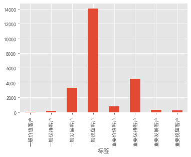


结论：  
由上表可看出，一般挽留客户人数最多，一般价值客户人数最少，
重要价值客户、重要发展客户人数均不到1000人，业务部门可根据
词表调整销售战略。

* **用户分层**
    * 新用户、活跃用户、流失用户、回流用户占比


```python
# 每个月有没有消费（columns="月份"而不是“日期”）
df_month_expenditure = df.pivot_table(index="用户id",
                                      columns="月份",
                                      values="订单数",
                                      aggfunc={
                                          "订单数": "count"
                                      }).fillna(0)
df_month_expenditure
```


<div>
<style scoped>
    .dataframe tbody tr th:only-of-type {
        vertical-align: middle;
    }

    .dataframe tbody tr th {
        vertical-align: top;
    }

    .dataframe thead th {
        text-align: right;
    }
</style>
<table border="1" class="dataframe">
  <thead>
    <tr style="text-align: right;">
      <th>月份</th>
      <th>1997-01-01</th>
      <th>1997-02-01</th>
      <th>1997-03-01</th>
      <th>1997-04-01</th>
      <th>1997-05-01</th>
      <th>1997-06-01</th>
      <th>1997-07-01</th>
      <th>1997-08-01</th>
      <th>1997-09-01</th>
      <th>1997-10-01</th>
      <th>1997-11-01</th>
      <th>1997-12-01</th>
      <th>1998-01-01</th>
      <th>1998-02-01</th>
      <th>1998-03-01</th>
      <th>1998-04-01</th>
      <th>1998-05-01</th>
      <th>1998-06-01</th>
    </tr>
    <tr>
      <th>用户id</th>
      <th></th>
      <th></th>
      <th></th>
      <th></th>
      <th></th>
      <th></th>
      <th></th>
      <th></th>
      <th></th>
      <th></th>
      <th></th>
      <th></th>
      <th></th>
      <th></th>
      <th></th>
      <th></th>
      <th></th>
      <th></th>
    </tr>
  </thead>
  <tbody>
    <tr>
      <th>1</th>
      <td>1.0</td>
      <td>0.0</td>
      <td>0.0</td>
      <td>0.0</td>
      <td>0.0</td>
      <td>0.0</td>
      <td>0.0</td>
      <td>0.0</td>
      <td>0.0</td>
      <td>0.0</td>
      <td>0.0</td>
      <td>0.0</td>
      <td>0.0</td>
      <td>0.0</td>
      <td>0.0</td>
      <td>0.0</td>
      <td>0.0</td>
      <td>0.0</td>
    </tr>
    <tr>
      <th>2</th>
      <td>2.0</td>
      <td>0.0</td>
      <td>0.0</td>
      <td>0.0</td>
      <td>0.0</td>
      <td>0.0</td>
      <td>0.0</td>
      <td>0.0</td>
      <td>0.0</td>
      <td>0.0</td>
      <td>0.0</td>
      <td>0.0</td>
      <td>0.0</td>
      <td>0.0</td>
      <td>0.0</td>
      <td>0.0</td>
      <td>0.0</td>
      <td>0.0</td>
    </tr>
    <tr>
      <th>3</th>
      <td>1.0</td>
      <td>0.0</td>
      <td>1.0</td>
      <td>1.0</td>
      <td>0.0</td>
      <td>0.0</td>
      <td>0.0</td>
      <td>0.0</td>
      <td>0.0</td>
      <td>0.0</td>
      <td>2.0</td>
      <td>0.0</td>
      <td>0.0</td>
      <td>0.0</td>
      <td>0.0</td>
      <td>0.0</td>
      <td>1.0</td>
      <td>0.0</td>
    </tr>
    <tr>
      <th>4</th>
      <td>2.0</td>
      <td>0.0</td>
      <td>0.0</td>
      <td>0.0</td>
      <td>0.0</td>
      <td>0.0</td>
      <td>0.0</td>
      <td>1.0</td>
      <td>0.0</td>
      <td>0.0</td>
      <td>0.0</td>
      <td>1.0</td>
      <td>0.0</td>
      <td>0.0</td>
      <td>0.0</td>
      <td>0.0</td>
      <td>0.0</td>
      <td>0.0</td>
    </tr>
    <tr>
      <th>5</th>
      <td>2.0</td>
      <td>1.0</td>
      <td>0.0</td>
      <td>1.0</td>
      <td>1.0</td>
      <td>1.0</td>
      <td>1.0</td>
      <td>0.0</td>
      <td>1.0</td>
      <td>0.0</td>
      <td>0.0</td>
      <td>2.0</td>
      <td>1.0</td>
      <td>0.0</td>
      <td>0.0</td>
      <td>0.0</td>
      <td>0.0</td>
      <td>0.0</td>
    </tr>
    <tr>
      <th>...</th>
      <td>...</td>
      <td>...</td>
      <td>...</td>
      <td>...</td>
      <td>...</td>
      <td>...</td>
      <td>...</td>
      <td>...</td>
      <td>...</td>
      <td>...</td>
      <td>...</td>
      <td>...</td>
      <td>...</td>
      <td>...</td>
      <td>...</td>
      <td>...</td>
      <td>...</td>
      <td>...</td>
    </tr>
    <tr>
      <th>23566</th>
      <td>0.0</td>
      <td>0.0</td>
      <td>1.0</td>
      <td>0.0</td>
      <td>0.0</td>
      <td>0.0</td>
      <td>0.0</td>
      <td>0.0</td>
      <td>0.0</td>
      <td>0.0</td>
      <td>0.0</td>
      <td>0.0</td>
      <td>0.0</td>
      <td>0.0</td>
      <td>0.0</td>
      <td>0.0</td>
      <td>0.0</td>
      <td>0.0</td>
    </tr>
    <tr>
      <th>23567</th>
      <td>0.0</td>
      <td>0.0</td>
      <td>1.0</td>
      <td>0.0</td>
      <td>0.0</td>
      <td>0.0</td>
      <td>0.0</td>
      <td>0.0</td>
      <td>0.0</td>
      <td>0.0</td>
      <td>0.0</td>
      <td>0.0</td>
      <td>0.0</td>
      <td>0.0</td>
      <td>0.0</td>
      <td>0.0</td>
      <td>0.0</td>
      <td>0.0</td>
    </tr>
    <tr>
      <th>23568</th>
      <td>0.0</td>
      <td>0.0</td>
      <td>1.0</td>
      <td>2.0</td>
      <td>0.0</td>
      <td>0.0</td>
      <td>0.0</td>
      <td>0.0</td>
      <td>0.0</td>
      <td>0.0</td>
      <td>0.0</td>
      <td>0.0</td>
      <td>0.0</td>
      <td>0.0</td>
      <td>0.0</td>
      <td>0.0</td>
      <td>0.0</td>
      <td>0.0</td>
    </tr>
    <tr>
      <th>23569</th>
      <td>0.0</td>
      <td>0.0</td>
      <td>1.0</td>
      <td>0.0</td>
      <td>0.0</td>
      <td>0.0</td>
      <td>0.0</td>
      <td>0.0</td>
      <td>0.0</td>
      <td>0.0</td>
      <td>0.0</td>
      <td>0.0</td>
      <td>0.0</td>
      <td>0.0</td>
      <td>0.0</td>
      <td>0.0</td>
      <td>0.0</td>
      <td>0.0</td>
    </tr>
    <tr>
      <th>23570</th>
      <td>0.0</td>
      <td>0.0</td>
      <td>2.0</td>
      <td>0.0</td>
      <td>0.0</td>
      <td>0.0</td>
      <td>0.0</td>
      <td>0.0</td>
      <td>0.0</td>
      <td>0.0</td>
      <td>0.0</td>
      <td>0.0</td>
      <td>0.0</td>
      <td>0.0</td>
      <td>0.0</td>
      <td>0.0</td>
      <td>0.0</td>
      <td>0.0</td>
    </tr>
  </tbody>
</table>
<p>23570 rows × 18 columns</p>
</div>


```python
# 活跃度标记(耗时30分钟)
for i in range(0, len(df_month_expenditure.iloc[0, :])):
    for j in range(0, len(df_month_expenditure.iloc[:, 0])):
        
        # 第1个月的情况
        if i == 0:
            if df_month_expenditure.iloc[j, i] == 0:
                df_month_expenditure.iloc[j, i] = "未注册"

            else:
                df_month_expenditure.iloc[j, i] = "注册新用户"

        # 后面的月份
        else:
            
            # 当月为0的情况
            if df_month_expenditure.iloc[j, i] == 0:
                
                # 上个月为0的情况
                if df_month_expenditure.iloc[j, (i - 1)] == "未注册":
                    df_month_expenditure.iloc[j, i] = "未注册"

                elif df_month_expenditure.iloc[j, (i - 1)] == "不活跃":
                    df_month_expenditure.iloc[j, i] = "流失"

                elif df_month_expenditure.iloc[j, (i - 1)] == "流失":
                    df_month_expenditure.iloc[j, i] = "流失"

                # 上个月不为0的情况
                else:
                    df_month_expenditure.iloc[j, i] = "不活跃"

            # 当月不为0的情况
            else:
                # 上个月为0的情况
                if df_month_expenditure.iloc[j, (i - 1)] == "未注册":
                    df_month_expenditure.iloc[j, i] = "注册新用户"

                elif df_month_expenditure.iloc[j, (i - 1)] == "不活跃":
                    df_month_expenditure.iloc[j, i] = "活跃"

                elif df_month_expenditure.iloc[j, (i - 1)] == "流失":
                    df_month_expenditure.iloc[j, i] = "回流"

                # 上个月不为0的情况
                else:
                    df_month_expenditure.iloc[j, i] = "活跃"
df_month_expenditure
```


<div>
<style scoped>
    .dataframe tbody tr th:only-of-type {
        vertical-align: middle;
    }

    .dataframe tbody tr th {
        vertical-align: top;
    }

    .dataframe thead th {
        text-align: right;
    }
</style>
<table border="1" class="dataframe">
  <thead>
    <tr style="text-align: right;">
      <th>月份</th>
      <th>1997-01-01</th>
      <th>1997-02-01</th>
      <th>1997-03-01</th>
      <th>1997-04-01</th>
      <th>1997-05-01</th>
      <th>1997-06-01</th>
      <th>1997-07-01</th>
      <th>1997-08-01</th>
      <th>1997-09-01</th>
      <th>1997-10-01</th>
      <th>1997-11-01</th>
      <th>1997-12-01</th>
      <th>1998-01-01</th>
      <th>1998-02-01</th>
      <th>1998-03-01</th>
      <th>1998-04-01</th>
      <th>1998-05-01</th>
      <th>1998-06-01</th>
    </tr>
    <tr>
      <th>用户id</th>
      <th></th>
      <th></th>
      <th></th>
      <th></th>
      <th></th>
      <th></th>
      <th></th>
      <th></th>
      <th></th>
      <th></th>
      <th></th>
      <th></th>
      <th></th>
      <th></th>
      <th></th>
      <th></th>
      <th></th>
      <th></th>
    </tr>
  </thead>
  <tbody>
    <tr>
      <th>1</th>
      <td>注册新用户</td>
      <td>不活跃</td>
      <td>流失</td>
      <td>流失</td>
      <td>流失</td>
      <td>流失</td>
      <td>流失</td>
      <td>流失</td>
      <td>流失</td>
      <td>流失</td>
      <td>流失</td>
      <td>流失</td>
      <td>流失</td>
      <td>流失</td>
      <td>流失</td>
      <td>流失</td>
      <td>流失</td>
      <td>流失</td>
    </tr>
    <tr>
      <th>2</th>
      <td>注册新用户</td>
      <td>不活跃</td>
      <td>流失</td>
      <td>流失</td>
      <td>流失</td>
      <td>流失</td>
      <td>流失</td>
      <td>流失</td>
      <td>流失</td>
      <td>流失</td>
      <td>流失</td>
      <td>流失</td>
      <td>流失</td>
      <td>流失</td>
      <td>流失</td>
      <td>流失</td>
      <td>流失</td>
      <td>流失</td>
    </tr>
    <tr>
      <th>3</th>
      <td>注册新用户</td>
      <td>不活跃</td>
      <td>活跃</td>
      <td>活跃</td>
      <td>不活跃</td>
      <td>流失</td>
      <td>流失</td>
      <td>流失</td>
      <td>流失</td>
      <td>流失</td>
      <td>回流</td>
      <td>不活跃</td>
      <td>流失</td>
      <td>流失</td>
      <td>流失</td>
      <td>流失</td>
      <td>回流</td>
      <td>不活跃</td>
    </tr>
    <tr>
      <th>4</th>
      <td>注册新用户</td>
      <td>不活跃</td>
      <td>流失</td>
      <td>流失</td>
      <td>流失</td>
      <td>流失</td>
      <td>流失</td>
      <td>回流</td>
      <td>不活跃</td>
      <td>流失</td>
      <td>流失</td>
      <td>回流</td>
      <td>不活跃</td>
      <td>流失</td>
      <td>流失</td>
      <td>流失</td>
      <td>流失</td>
      <td>流失</td>
    </tr>
    <tr>
      <th>5</th>
      <td>注册新用户</td>
      <td>活跃</td>
      <td>不活跃</td>
      <td>活跃</td>
      <td>活跃</td>
      <td>活跃</td>
      <td>活跃</td>
      <td>不活跃</td>
      <td>活跃</td>
      <td>不活跃</td>
      <td>流失</td>
      <td>回流</td>
      <td>活跃</td>
      <td>不活跃</td>
      <td>流失</td>
      <td>流失</td>
      <td>流失</td>
      <td>流失</td>
    </tr>
    <tr>
      <th>...</th>
      <td>...</td>
      <td>...</td>
      <td>...</td>
      <td>...</td>
      <td>...</td>
      <td>...</td>
      <td>...</td>
      <td>...</td>
      <td>...</td>
      <td>...</td>
      <td>...</td>
      <td>...</td>
      <td>...</td>
      <td>...</td>
      <td>...</td>
      <td>...</td>
      <td>...</td>
      <td>...</td>
    </tr>
    <tr>
      <th>23566</th>
      <td>未注册</td>
      <td>未注册</td>
      <td>注册新用户</td>
      <td>不活跃</td>
      <td>流失</td>
      <td>流失</td>
      <td>流失</td>
      <td>流失</td>
      <td>流失</td>
      <td>流失</td>
      <td>流失</td>
      <td>流失</td>
      <td>流失</td>
      <td>流失</td>
      <td>流失</td>
      <td>流失</td>
      <td>流失</td>
      <td>流失</td>
    </tr>
    <tr>
      <th>23567</th>
      <td>未注册</td>
      <td>未注册</td>
      <td>注册新用户</td>
      <td>不活跃</td>
      <td>流失</td>
      <td>流失</td>
      <td>流失</td>
      <td>流失</td>
      <td>流失</td>
      <td>流失</td>
      <td>流失</td>
      <td>流失</td>
      <td>流失</td>
      <td>流失</td>
      <td>流失</td>
      <td>流失</td>
      <td>流失</td>
      <td>流失</td>
    </tr>
    <tr>
      <th>23568</th>
      <td>未注册</td>
      <td>未注册</td>
      <td>注册新用户</td>
      <td>活跃</td>
      <td>不活跃</td>
      <td>流失</td>
      <td>流失</td>
      <td>流失</td>
      <td>流失</td>
      <td>流失</td>
      <td>流失</td>
      <td>流失</td>
      <td>流失</td>
      <td>流失</td>
      <td>流失</td>
      <td>流失</td>
      <td>流失</td>
      <td>流失</td>
    </tr>
    <tr>
      <th>23569</th>
      <td>未注册</td>
      <td>未注册</td>
      <td>注册新用户</td>
      <td>不活跃</td>
      <td>流失</td>
      <td>流失</td>
      <td>流失</td>
      <td>流失</td>
      <td>流失</td>
      <td>流失</td>
      <td>流失</td>
      <td>流失</td>
      <td>流失</td>
      <td>流失</td>
      <td>流失</td>
      <td>流失</td>
      <td>流失</td>
      <td>流失</td>
    </tr>
    <tr>
      <th>23570</th>
      <td>未注册</td>
      <td>未注册</td>
      <td>注册新用户</td>
      <td>不活跃</td>
      <td>流失</td>
      <td>流失</td>
      <td>流失</td>
      <td>流失</td>
      <td>流失</td>
      <td>流失</td>
      <td>流失</td>
      <td>流失</td>
      <td>流失</td>
      <td>流失</td>
      <td>流失</td>
      <td>流失</td>
      <td>流失</td>
      <td>流失</td>
    </tr>
  </tbody>
</table>
<p>23570 rows × 18 columns</p>
</div>


```python
#耗时比较久，所以运行结束后保存起来
file_path = r"用户活跃度统计.csv"
df_month_expenditure.to_csv(file_path, encoding="UTF-8",index=0)
```


```python
#读取保存的csv
file_path = r"用户活跃度统计.csv"
df_0= pd.read_csv(file_path)
df_0
```


<div>
<style scoped>
    .dataframe tbody tr th:only-of-type {
        vertical-align: middle;
    }

    .dataframe tbody tr th {
        vertical-align: top;
    }

    .dataframe thead th {
        text-align: right;
    }
</style>
<table border="1" class="dataframe">
  <thead>
    <tr style="text-align: right;">
      <th></th>
      <th>1997-01-01</th>
      <th>1997-02-01</th>
      <th>1997-03-01</th>
      <th>1997-04-01</th>
      <th>1997-05-01</th>
      <th>1997-06-01</th>
      <th>1997-07-01</th>
      <th>1997-08-01</th>
      <th>1997-09-01</th>
      <th>1997-10-01</th>
      <th>1997-11-01</th>
      <th>1997-12-01</th>
      <th>1998-01-01</th>
      <th>1998-02-01</th>
      <th>1998-03-01</th>
      <th>1998-04-01</th>
      <th>1998-05-01</th>
      <th>1998-06-01</th>
    </tr>
  </thead>
  <tbody>
    <tr>
      <th>0</th>
      <td>注册新用户</td>
      <td>不活跃</td>
      <td>流失</td>
      <td>流失</td>
      <td>流失</td>
      <td>流失</td>
      <td>流失</td>
      <td>流失</td>
      <td>流失</td>
      <td>流失</td>
      <td>流失</td>
      <td>流失</td>
      <td>流失</td>
      <td>流失</td>
      <td>流失</td>
      <td>流失</td>
      <td>流失</td>
      <td>流失</td>
    </tr>
    <tr>
      <th>1</th>
      <td>注册新用户</td>
      <td>不活跃</td>
      <td>流失</td>
      <td>流失</td>
      <td>流失</td>
      <td>流失</td>
      <td>流失</td>
      <td>流失</td>
      <td>流失</td>
      <td>流失</td>
      <td>流失</td>
      <td>流失</td>
      <td>流失</td>
      <td>流失</td>
      <td>流失</td>
      <td>流失</td>
      <td>流失</td>
      <td>流失</td>
    </tr>
    <tr>
      <th>2</th>
      <td>注册新用户</td>
      <td>不活跃</td>
      <td>活跃</td>
      <td>活跃</td>
      <td>不活跃</td>
      <td>流失</td>
      <td>流失</td>
      <td>流失</td>
      <td>流失</td>
      <td>流失</td>
      <td>回流</td>
      <td>不活跃</td>
      <td>流失</td>
      <td>流失</td>
      <td>流失</td>
      <td>流失</td>
      <td>回流</td>
      <td>不活跃</td>
    </tr>
    <tr>
      <th>3</th>
      <td>注册新用户</td>
      <td>不活跃</td>
      <td>流失</td>
      <td>流失</td>
      <td>流失</td>
      <td>流失</td>
      <td>流失</td>
      <td>回流</td>
      <td>不活跃</td>
      <td>流失</td>
      <td>流失</td>
      <td>回流</td>
      <td>不活跃</td>
      <td>流失</td>
      <td>流失</td>
      <td>流失</td>
      <td>流失</td>
      <td>流失</td>
    </tr>
    <tr>
      <th>4</th>
      <td>注册新用户</td>
      <td>活跃</td>
      <td>不活跃</td>
      <td>活跃</td>
      <td>活跃</td>
      <td>活跃</td>
      <td>活跃</td>
      <td>不活跃</td>
      <td>活跃</td>
      <td>不活跃</td>
      <td>流失</td>
      <td>回流</td>
      <td>活跃</td>
      <td>不活跃</td>
      <td>流失</td>
      <td>流失</td>
      <td>流失</td>
      <td>流失</td>
    </tr>
    <tr>
      <th>...</th>
      <td>...</td>
      <td>...</td>
      <td>...</td>
      <td>...</td>
      <td>...</td>
      <td>...</td>
      <td>...</td>
      <td>...</td>
      <td>...</td>
      <td>...</td>
      <td>...</td>
      <td>...</td>
      <td>...</td>
      <td>...</td>
      <td>...</td>
      <td>...</td>
      <td>...</td>
      <td>...</td>
    </tr>
    <tr>
      <th>23565</th>
      <td>未注册</td>
      <td>未注册</td>
      <td>注册新用户</td>
      <td>不活跃</td>
      <td>流失</td>
      <td>流失</td>
      <td>流失</td>
      <td>流失</td>
      <td>流失</td>
      <td>流失</td>
      <td>流失</td>
      <td>流失</td>
      <td>流失</td>
      <td>流失</td>
      <td>流失</td>
      <td>流失</td>
      <td>流失</td>
      <td>流失</td>
    </tr>
    <tr>
      <th>23566</th>
      <td>未注册</td>
      <td>未注册</td>
      <td>注册新用户</td>
      <td>不活跃</td>
      <td>流失</td>
      <td>流失</td>
      <td>流失</td>
      <td>流失</td>
      <td>流失</td>
      <td>流失</td>
      <td>流失</td>
      <td>流失</td>
      <td>流失</td>
      <td>流失</td>
      <td>流失</td>
      <td>流失</td>
      <td>流失</td>
      <td>流失</td>
    </tr>
    <tr>
      <th>23567</th>
      <td>未注册</td>
      <td>未注册</td>
      <td>注册新用户</td>
      <td>活跃</td>
      <td>不活跃</td>
      <td>流失</td>
      <td>流失</td>
      <td>流失</td>
      <td>流失</td>
      <td>流失</td>
      <td>流失</td>
      <td>流失</td>
      <td>流失</td>
      <td>流失</td>
      <td>流失</td>
      <td>流失</td>
      <td>流失</td>
      <td>流失</td>
    </tr>
    <tr>
      <th>23568</th>
      <td>未注册</td>
      <td>未注册</td>
      <td>注册新用户</td>
      <td>不活跃</td>
      <td>流失</td>
      <td>流失</td>
      <td>流失</td>
      <td>流失</td>
      <td>流失</td>
      <td>流失</td>
      <td>流失</td>
      <td>流失</td>
      <td>流失</td>
      <td>流失</td>
      <td>流失</td>
      <td>流失</td>
      <td>流失</td>
      <td>流失</td>
    </tr>
    <tr>
      <th>23569</th>
      <td>未注册</td>
      <td>未注册</td>
      <td>注册新用户</td>
      <td>不活跃</td>
      <td>流失</td>
      <td>流失</td>
      <td>流失</td>
      <td>流失</td>
      <td>流失</td>
      <td>流失</td>
      <td>流失</td>
      <td>流失</td>
      <td>流失</td>
      <td>流失</td>
      <td>流失</td>
      <td>流失</td>
      <td>流失</td>
      <td>流失</td>
    </tr>
  </tbody>
</table>
<p>23570 rows × 18 columns</p>
</div>


```python
# 不同活跃度用户聚合
df_counts = df_0.apply(lambda x: pd.value_counts(x))  # pd.value_counts(x)统计次数
df_counts
```


<div>
<style scoped>
    .dataframe tbody tr th:only-of-type {
        vertical-align: middle;
    }

    .dataframe tbody tr th {
        vertical-align: top;
    }

    .dataframe thead th {
        text-align: right;
    }
</style>
<table border="1" class="dataframe">
  <thead>
    <tr style="text-align: right;">
      <th></th>
      <th>1997-01-01</th>
      <th>1997-02-01</th>
      <th>1997-03-01</th>
      <th>1997-04-01</th>
      <th>1997-05-01</th>
      <th>1997-06-01</th>
      <th>1997-07-01</th>
      <th>1997-08-01</th>
      <th>1997-09-01</th>
      <th>1997-10-01</th>
      <th>1997-11-01</th>
      <th>1997-12-01</th>
      <th>1998-01-01</th>
      <th>1998-02-01</th>
      <th>1998-03-01</th>
      <th>1998-04-01</th>
      <th>1998-05-01</th>
      <th>1998-06-01</th>
    </tr>
  </thead>
  <tbody>
    <tr>
      <th>不活跃</th>
      <td>NaN</td>
      <td>6689.0</td>
      <td>7952.0</td>
      <td>7751.0</td>
      <td>1970.0</td>
      <td>1467.0</td>
      <td>1593.0</td>
      <td>1576.0</td>
      <td>1244.0</td>
      <td>1207.0</td>
      <td>1215.0</td>
      <td>1396.0</td>
      <td>1352.0</td>
      <td>1065.0</td>
      <td>980.0</td>
      <td>1542.0</td>
      <td>978.0</td>
      <td>1042.0</td>
    </tr>
    <tr>
      <th>回流</th>
      <td>NaN</td>
      <td>NaN</td>
      <td>NaN</td>
      <td>352.0</td>
      <td>583.0</td>
      <td>1192.0</td>
      <td>1132.0</td>
      <td>881.0</td>
      <td>915.0</td>
      <td>1046.0</td>
      <td>1088.0</td>
      <td>978.0</td>
      <td>773.0</td>
      <td>833.0</td>
      <td>1201.0</td>
      <td>719.0</td>
      <td>703.0</td>
      <td>851.0</td>
    </tr>
    <tr>
      <th>未注册</th>
      <td>15724.0</td>
      <td>7248.0</td>
      <td>NaN</td>
      <td>NaN</td>
      <td>NaN</td>
      <td>NaN</td>
      <td>NaN</td>
      <td>NaN</td>
      <td>NaN</td>
      <td>NaN</td>
      <td>NaN</td>
      <td>NaN</td>
      <td>NaN</td>
      <td>NaN</td>
      <td>NaN</td>
      <td>NaN</td>
      <td>NaN</td>
      <td>NaN</td>
    </tr>
    <tr>
      <th>注册新用户</th>
      <td>7846.0</td>
      <td>8476.0</td>
      <td>7248.0</td>
      <td>NaN</td>
      <td>NaN</td>
      <td>NaN</td>
      <td>NaN</td>
      <td>NaN</td>
      <td>NaN</td>
      <td>NaN</td>
      <td>NaN</td>
      <td>NaN</td>
      <td>NaN</td>
      <td>NaN</td>
      <td>NaN</td>
      <td>NaN</td>
      <td>NaN</td>
      <td>NaN</td>
    </tr>
    <tr>
      <th>活跃</th>
      <td>NaN</td>
      <td>1157.0</td>
      <td>2276.0</td>
      <td>2470.0</td>
      <td>1631.0</td>
      <td>1147.0</td>
      <td>1048.0</td>
      <td>891.0</td>
      <td>824.0</td>
      <td>793.0</td>
      <td>940.0</td>
      <td>886.0</td>
      <td>764.0</td>
      <td>718.0</td>
      <td>859.0</td>
      <td>718.0</td>
      <td>785.0</td>
      <td>655.0</td>
    </tr>
    <tr>
      <th>流失</th>
      <td>NaN</td>
      <td>NaN</td>
      <td>6094.0</td>
      <td>12997.0</td>
      <td>19386.0</td>
      <td>19764.0</td>
      <td>19797.0</td>
      <td>20222.0</td>
      <td>20587.0</td>
      <td>20524.0</td>
      <td>20327.0</td>
      <td>20310.0</td>
      <td>20681.0</td>
      <td>20954.0</td>
      <td>20530.0</td>
      <td>20591.0</td>
      <td>21104.0</td>
      <td>21022.0</td>
    </tr>
  </tbody>
</table>
</div>


```python
df_counts_T = df_counts.fillna(0).T
df_counts_T.describe()
```


<div>
<style scoped>
    .dataframe tbody tr th:only-of-type {
        vertical-align: middle;
    }

    .dataframe tbody tr th {
        vertical-align: top;
    }

    .dataframe thead th {
        text-align: right;
    }
</style>
<table border="1" class="dataframe">
  <thead>
    <tr style="text-align: right;">
      <th></th>
      <th>不活跃</th>
      <th>回流</th>
      <th>未注册</th>
      <th>注册新用户</th>
      <th>活跃</th>
      <th>流失</th>
    </tr>
  </thead>
  <tbody>
    <tr>
      <th>count</th>
      <td>18.000000</td>
      <td>18.000000</td>
      <td>18.000000</td>
      <td>18.000000</td>
      <td>18.000000</td>
      <td>18.000000</td>
    </tr>
    <tr>
      <th>mean</th>
      <td>2278.833333</td>
      <td>735.944444</td>
      <td>1276.222222</td>
      <td>1309.444444</td>
      <td>1031.222222</td>
      <td>16938.333333</td>
    </tr>
    <tr>
      <th>std</th>
      <td>2430.274040</td>
      <td>401.024053</td>
      <td>3988.662632</td>
      <td>3020.247267</td>
      <td>580.082606</td>
      <td>7191.919943</td>
    </tr>
    <tr>
      <th>min</th>
      <td>0.000000</td>
      <td>0.000000</td>
      <td>0.000000</td>
      <td>0.000000</td>
      <td>0.000000</td>
      <td>0.000000</td>
    </tr>
    <tr>
      <th>25%</th>
      <td>1100.500000</td>
      <td>613.000000</td>
      <td>0.000000</td>
      <td>0.000000</td>
      <td>769.250000</td>
      <td>19480.500000</td>
    </tr>
    <tr>
      <th>50%</th>
      <td>1374.000000</td>
      <td>842.000000</td>
      <td>0.000000</td>
      <td>0.000000</td>
      <td>872.500000</td>
      <td>20318.500000</td>
    </tr>
    <tr>
      <th>75%</th>
      <td>1588.750000</td>
      <td>1029.000000</td>
      <td>0.000000</td>
      <td>0.000000</td>
      <td>1122.250000</td>
      <td>20590.000000</td>
    </tr>
    <tr>
      <th>max</th>
      <td>7952.000000</td>
      <td>1201.000000</td>
      <td>15724.000000</td>
      <td>8476.000000</td>
      <td>2470.000000</td>
      <td>21104.000000</td>
    </tr>
  </tbody>
</table>
</div>


```python
df_counts_T.plot.area()
plt.title("不同活跃度用户占比图")
plt.xlabel("月份")
plt.ylabel("用户数")
plt.show()
```


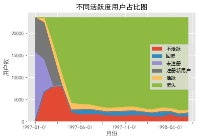


结论：  
由图可以看出：  
1. 不活跃用户数第一个月为0，前3个月增加明显，
第2月达到最大，超过7500人，第4个月回落，
后面趋于平稳。
2. 回流用户从第4个月开始产生，并且保持比较平稳的
数值。
3. 未注册用户只出现在前2个月，且数量呈减少趋势。
4. 活跃用户的比重均处于平稳状态，并且从第5个月器，
其占的比重相对于回流用户、不活跃用户差不多。
5. 流失用户从第2个月开始产生，并从第2个月至第4个月，
呈快速增长的模式增加，从第5个月开始趋于平稳状态，
并且占所有类型用户中超大比重（约为80%）。

* **用户购买周期**


```python
#用户两次购买的时间间隔
df_time_interval = df_groupby.apply(lambda x: x["日期"] - x["日期"].shift())
df_time_interval = df_time_interval / np.timedelta64(1, "D")
df_time_interval
```


    用户id        
    1      0         NaN
    2      1         NaN
           2         0.0
    3      3         NaN
           4        87.0
                    ... 
    23568  69654    11.0
           69655    17.0
    23569  69656     NaN
    23570  69657     NaN
           69658     1.0
    Name: 日期, Length: 69659, dtype: float64


```python
df_time_interval.plot.hist(bins=100)
plt.title("用户消费周期分布图")
plt.xlabel("天数")
plt.ylabel("人数")
plt.show()
```


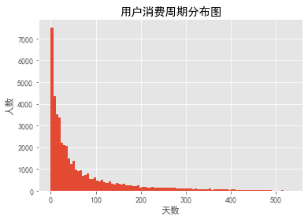


结论：  
由上图可知，消费周期在5天之内的用户数最多，超过8000人，
消费周期在5-10天之间的用户数仅有4000多人，
用户数随着消费周期增加而减少。
由此可见，用户消费行为比较活跃。

* **用户生命周期**


```python
#求出最后一次购买与第一次购买的时间间隔
user_life = (df_groupby["日期"].max() - df_groupby["日期"].min()) / np.timedelta64(1, "D")
user_life
```


    用户id
    1          0.0
    2          0.0
    3        511.0
    4        345.0
    5        367.0
             ...  
    23566      0.0
    23567      0.0
    23568     28.0
    23569      0.0
    23570      1.0
    Name: 日期, Length: 23570, dtype: float64


```python
# 排除掉只购买一次的用户
user_life_1 = user_life[user_life > 0]
user_life_1.describe()
```


    count    11516.000000
    mean       276.044807
    std        166.633990
    min          1.000000
    25%        117.000000
    50%        302.000000
    75%        429.000000
    max        544.000000
    Name: 日期, dtype: float64


```python
plt.hist(user_life_1, bins=100)
plt.title("用户生命周期直方图")
plt.show()
```


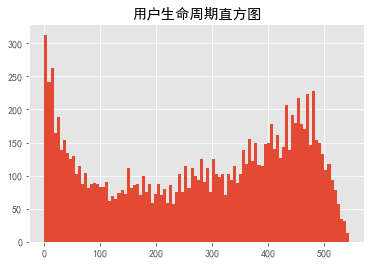


结论：  
由图可知，用户生命周期为1-5天的用户数最多，超过300人。
从0-150天，用户数随生命周期的增大而减少。从150-480天，
用户数随生命周期增大而增大，超过480天后，用户数随生命周期增大而减少。  
由此说明，生命周期为0-150天的用户为不稳定用户，
生命周期为150-480天的用户为稳定用户，会持续购买。
生命周期超过480天以后，能留下来的用户越来越少。说明
需调整销售策略，留住用户。

### 4. 复购率和回购率分析

#### 包括以下内容：

* 复购率
* 回购率

#### 实现步骤如下：

* **复购率**

自然月内，购买多次的用户占，
比即求这个月里订单数大于等于2的用户数与总用户数的商


```python
df_groupby = df.pivot_table(index="用户id",
                                      columns="月份",
                                      values="订单数",
                                      aggfunc={
                                          "订单数": "count"
                                      })
df_groupby
```


<div>
<style scoped>
    .dataframe tbody tr th:only-of-type {
        vertical-align: middle;
    }

    .dataframe tbody tr th {
        vertical-align: top;
    }

    .dataframe thead th {
        text-align: right;
    }
</style>
<table border="1" class="dataframe">
  <thead>
    <tr style="text-align: right;">
      <th>月份</th>
      <th>1997-01-01</th>
      <th>1997-02-01</th>
      <th>1997-03-01</th>
      <th>1997-04-01</th>
      <th>1997-05-01</th>
      <th>1997-06-01</th>
      <th>1997-07-01</th>
      <th>1997-08-01</th>
      <th>1997-09-01</th>
      <th>1997-10-01</th>
      <th>1997-11-01</th>
      <th>1997-12-01</th>
      <th>1998-01-01</th>
      <th>1998-02-01</th>
      <th>1998-03-01</th>
      <th>1998-04-01</th>
      <th>1998-05-01</th>
      <th>1998-06-01</th>
    </tr>
    <tr>
      <th>用户id</th>
      <th></th>
      <th></th>
      <th></th>
      <th></th>
      <th></th>
      <th></th>
      <th></th>
      <th></th>
      <th></th>
      <th></th>
      <th></th>
      <th></th>
      <th></th>
      <th></th>
      <th></th>
      <th></th>
      <th></th>
      <th></th>
    </tr>
  </thead>
  <tbody>
    <tr>
      <th>1</th>
      <td>1.0</td>
      <td>NaN</td>
      <td>NaN</td>
      <td>NaN</td>
      <td>NaN</td>
      <td>NaN</td>
      <td>NaN</td>
      <td>NaN</td>
      <td>NaN</td>
      <td>NaN</td>
      <td>NaN</td>
      <td>NaN</td>
      <td>NaN</td>
      <td>NaN</td>
      <td>NaN</td>
      <td>NaN</td>
      <td>NaN</td>
      <td>NaN</td>
    </tr>
    <tr>
      <th>2</th>
      <td>2.0</td>
      <td>NaN</td>
      <td>NaN</td>
      <td>NaN</td>
      <td>NaN</td>
      <td>NaN</td>
      <td>NaN</td>
      <td>NaN</td>
      <td>NaN</td>
      <td>NaN</td>
      <td>NaN</td>
      <td>NaN</td>
      <td>NaN</td>
      <td>NaN</td>
      <td>NaN</td>
      <td>NaN</td>
      <td>NaN</td>
      <td>NaN</td>
    </tr>
    <tr>
      <th>3</th>
      <td>1.0</td>
      <td>NaN</td>
      <td>1.0</td>
      <td>1.0</td>
      <td>NaN</td>
      <td>NaN</td>
      <td>NaN</td>
      <td>NaN</td>
      <td>NaN</td>
      <td>NaN</td>
      <td>2.0</td>
      <td>NaN</td>
      <td>NaN</td>
      <td>NaN</td>
      <td>NaN</td>
      <td>NaN</td>
      <td>1.0</td>
      <td>NaN</td>
    </tr>
    <tr>
      <th>4</th>
      <td>2.0</td>
      <td>NaN</td>
      <td>NaN</td>
      <td>NaN</td>
      <td>NaN</td>
      <td>NaN</td>
      <td>NaN</td>
      <td>1.0</td>
      <td>NaN</td>
      <td>NaN</td>
      <td>NaN</td>
      <td>1.0</td>
      <td>NaN</td>
      <td>NaN</td>
      <td>NaN</td>
      <td>NaN</td>
      <td>NaN</td>
      <td>NaN</td>
    </tr>
    <tr>
      <th>5</th>
      <td>2.0</td>
      <td>1.0</td>
      <td>NaN</td>
      <td>1.0</td>
      <td>1.0</td>
      <td>1.0</td>
      <td>1.0</td>
      <td>NaN</td>
      <td>1.0</td>
      <td>NaN</td>
      <td>NaN</td>
      <td>2.0</td>
      <td>1.0</td>
      <td>NaN</td>
      <td>NaN</td>
      <td>NaN</td>
      <td>NaN</td>
      <td>NaN</td>
    </tr>
    <tr>
      <th>...</th>
      <td>...</td>
      <td>...</td>
      <td>...</td>
      <td>...</td>
      <td>...</td>
      <td>...</td>
      <td>...</td>
      <td>...</td>
      <td>...</td>
      <td>...</td>
      <td>...</td>
      <td>...</td>
      <td>...</td>
      <td>...</td>
      <td>...</td>
      <td>...</td>
      <td>...</td>
      <td>...</td>
    </tr>
    <tr>
      <th>23566</th>
      <td>NaN</td>
      <td>NaN</td>
      <td>1.0</td>
      <td>NaN</td>
      <td>NaN</td>
      <td>NaN</td>
      <td>NaN</td>
      <td>NaN</td>
      <td>NaN</td>
      <td>NaN</td>
      <td>NaN</td>
      <td>NaN</td>
      <td>NaN</td>
      <td>NaN</td>
      <td>NaN</td>
      <td>NaN</td>
      <td>NaN</td>
      <td>NaN</td>
    </tr>
    <tr>
      <th>23567</th>
      <td>NaN</td>
      <td>NaN</td>
      <td>1.0</td>
      <td>NaN</td>
      <td>NaN</td>
      <td>NaN</td>
      <td>NaN</td>
      <td>NaN</td>
      <td>NaN</td>
      <td>NaN</td>
      <td>NaN</td>
      <td>NaN</td>
      <td>NaN</td>
      <td>NaN</td>
      <td>NaN</td>
      <td>NaN</td>
      <td>NaN</td>
      <td>NaN</td>
    </tr>
    <tr>
      <th>23568</th>
      <td>NaN</td>
      <td>NaN</td>
      <td>1.0</td>
      <td>2.0</td>
      <td>NaN</td>
      <td>NaN</td>
      <td>NaN</td>
      <td>NaN</td>
      <td>NaN</td>
      <td>NaN</td>
      <td>NaN</td>
      <td>NaN</td>
      <td>NaN</td>
      <td>NaN</td>
      <td>NaN</td>
      <td>NaN</td>
      <td>NaN</td>
      <td>NaN</td>
    </tr>
    <tr>
      <th>23569</th>
      <td>NaN</td>
      <td>NaN</td>
      <td>1.0</td>
      <td>NaN</td>
      <td>NaN</td>
      <td>NaN</td>
      <td>NaN</td>
      <td>NaN</td>
      <td>NaN</td>
      <td>NaN</td>
      <td>NaN</td>
      <td>NaN</td>
      <td>NaN</td>
      <td>NaN</td>
      <td>NaN</td>
      <td>NaN</td>
      <td>NaN</td>
      <td>NaN</td>
    </tr>
    <tr>
      <th>23570</th>
      <td>NaN</td>
      <td>NaN</td>
      <td>2.0</td>
      <td>NaN</td>
      <td>NaN</td>
      <td>NaN</td>
      <td>NaN</td>
      <td>NaN</td>
      <td>NaN</td>
      <td>NaN</td>
      <td>NaN</td>
      <td>NaN</td>
      <td>NaN</td>
      <td>NaN</td>
      <td>NaN</td>
      <td>NaN</td>
      <td>NaN</td>
      <td>NaN</td>
    </tr>
  </tbody>
</table>
<p>23570 rows × 18 columns</p>
</div>


```python
# 购买总次数
df_groupby_count = df_groupby.count()
df_groupby_count
```


    月份
    1997-01-01    7846
    1997-02-01    9633
    1997-03-01    9524
    1997-04-01    2822
    1997-05-01    2214
    1997-06-01    2339
    1997-07-01    2180
    1997-08-01    1772
    1997-09-01    1739
    1997-10-01    1839
    1997-11-01    2028
    1997-12-01    1864
    1998-01-01    1537
    1998-02-01    1551
    1998-03-01    2060
    1998-04-01    1437
    1998-05-01    1488
    1998-06-01    1506
    dtype: int64


```python
# 购买两次以上的次数
df_more_than_once = df_groupby[df_groupby > 1]
df_more_than_once_count = df_more_than_once.count()
df_more_than_once_count
```


    月份
    1997-01-01     844
    1997-02-01    1178
    1997-03-01    1479
    1997-04-01     631
    1997-05-01     436
    1997-06-01     458
    1997-07-01     469
    1997-08-01     355
    1997-09-01     352
    1997-10-01     380
    1997-11-01     410
    1997-12-01     410
    1998-01-01     324
    1998-02-01     315
    1998-03-01     473
    1998-04-01     286
    1998-05-01     298
    1998-06-01     323
    dtype: int64


```python
# 复购率
repurchase = df_more_than_once_count / df_groupby_count
repurchase.describe()
```


    count    18.000000
    mean      0.194745
    std       0.033045
    min       0.107571
    25%       0.197453
    50%       0.202292
    75%       0.213557
    max       0.229612
    dtype: float64


```python
repurchase.plot()
plt.title("每月复购率走势图")
plt.xlabel("月份")
plt.ylabel("复购率")
plt.show()
```


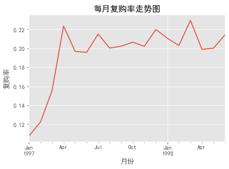


结论：  
由图可知，1月份复购率最低，为0.11。
2、3月份复购率逐渐上升，从4月份开始，复购率呈现
小幅波动的稳定状态，基本保持在0.20-0.23之间。
说明前3个月的用户复购率不高，流失较为严重。

* **回购率**

从第二月开始回购的总人数除以购买的总人数


```python
# 新建一个全为0的以为数组，用于存放回购率数据
buy_again = pd.Series(0, index=df_groupby.columns)
buy_again
```


    月份
    1997-01-01    0
    1997-02-01    0
    1997-03-01    0
    1997-04-01    0
    1997-05-01    0
    1997-06-01    0
    1997-07-01    0
    1997-08-01    0
    1997-09-01    0
    1997-10-01    0
    1997-11-01    0
    1997-12-01    0
    1998-01-01    0
    1998-02-01    0
    1998-03-01    0
    1998-04-01    0
    1998-05-01    0
    1998-06-01    0
    dtype: int64


```python
# 如果某用户本月和下一月订单数都大于0，算是该用户复购，把所有复购的用户累加
for j in range(0, len(df_groupby.iloc[0, :]) - 1):
    for i in range(0, len(df_groupby.iloc[:, 0])):
        # 如果本月有购买、下个月也有购买，则该用户属于回购
        if df_groupby.iloc[i, j] > 0 and df_groupby.iloc[i, j + 1] > 0:
        # 则该月回购的用户数+1    
            buy_again[j + 1] = buy_again[j + 1] + 1
buy_again
```


    月份
    1997-01-01       0
    1997-02-01    1157
    1997-03-01    1681
    1997-04-01    1773
    1997-05-01     852
    1997-06-01     747
    1997-07-01     746
    1997-08-01     604
    1997-09-01     528
    1997-10-01     532
    1997-11-01     624
    1997-12-01     632
    1998-01-01     512
    1998-02-01     472
    1998-03-01     571
    1998-04-01     518
    1998-05-01     459
    1998-06-01     446
    dtype: int64


```python
# 回购率
repurchase_ = buy_again / df_groupby_count
repurchase_.describe()
```


    count    18.000000
    mean      0.301750
    std       0.124484
    min       0.000000
    25%       0.291003
    50%       0.308080
    75%       0.340407
    max       0.628278
    dtype: float64


```python
repurchase_.plot()
plt.title("每月回购率曲线图")
plt.ylabel("回购率")
plt.xlabel("月份")
plt.show()
```


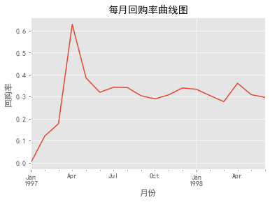


结论：  
由上图可知，回购率从1月到4月，回购率呈大幅度攀升状态，
在4月份达到峰值，大约为0.7。
5月份回购率陡然回落，此后回购率呈小幅波动的平稳装填。
维持在0.28-0.38之间。

## 四、结论

1. 整体趋势：  
按年的月份趋势销量和销售额在1-3月份相对极高，然后骤降，原因可能跟这段时间的大力促销或与商品的季度属性有关。

2. 用户个体特征：  
每笔订单的金额和商品购买量都集中在区间的低段水平，都是小金额小批量进行购买，此类交易群体，可在丰富产品线和增加促销活动提高转换率和购买率。

3. 大部分用户的消费总额和购买总量都集中刚在低段，长尾分布，这个跟用户需求有关，可以对商品进行多元文化价值的赋予，增强其社交价值属性，提高用户的价值需求。

4. 用户的消费周期：  
有二次以上消费的用户，平均68天，所以在50天到60天期间，应该对这批用户进行刺激召回，细致点，比如10天回复满意度，30天发放优惠券，55天的时候提醒优惠券的使用。

5. 用户的生命周期：  
有二次及以上消费的用户的平均生命周期是276天。用户的生命周期分别在20天内与400至500天间，应该在20天内对客户进行引导，促进其再次消费并形成消费习惯，延长其生命周期；在100至400天的用户，也要根据其特点推出有针对性的营销活动，引导其持续消费。

6. 新客户的复购率约为6%，老客户的复购率在20%左右；新客户的回购率在15%左右，老客户的回购率在30%左右，需要营销策略积极引导其再次消费及持续消费。

7. 用户质量：  
用户个体消费有一定规律性，大部分用户的消费集中在2000以下，用户消费反应了2/8法则，消费排名前20%的用户贡献了80%的消费额。所以说，狠抓高质量用户是万古不变的道理，这些高质量客户都是“会员”类型，需要专门为会员优化购物体验，比如专线接听、特殊优惠等等。

